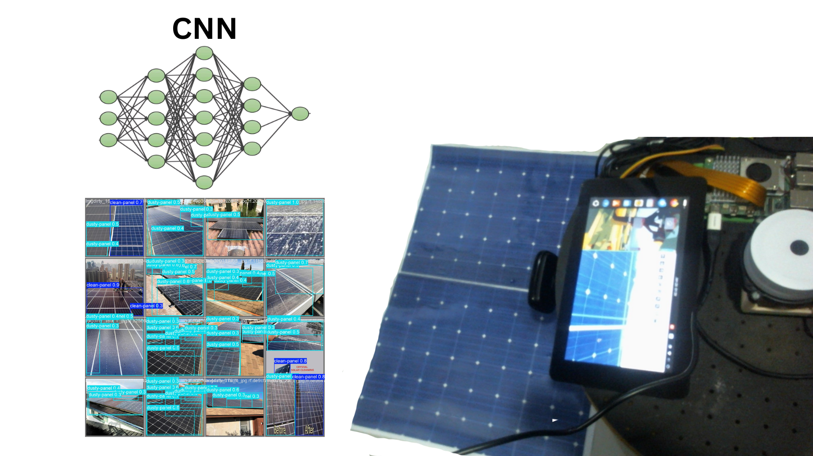

# Autonomous Dust Detection and Cleaning Robot for Solar Panels


## Overview
This project integrates **deep learning-based visual perception** with **mobile robot control** to simulate an intelligent cleaning robot for solar panels.  

A **custom YOLOv8 model** was trained to classify **clean** and **dusty** solar panels.  
The trained model was then deployed on a **mobile robot** equipped with a camera and an Arduino controller.  
The robot analyzes the surface beneath it, detects dusty regions, and moves accordingly using a simple experimental control law.  

This serves as a foundation for developing an **autonomous solar panel maintenance system** powered by AI and robotics.

---

## How It Works

1. **Model Training**
   - The YOLOv8 model (`yolov8s.pt`) is fine-tuned on a labeled dataset of solar panels.
   - Labels:  
     - `0: clean-panel`  
     - `1: dusty-panel`
   - The dataset configuration is defined in `dataset.yaml`.

2. **Detection and Control**
   - The trained model is loaded and used for real-time inference.
   - The robot divides the camera frame into **four regions**.
   - When dust is detected in a region, it moves toward that area using serial commands sent to an Arduino.

3. **Robot Movement**
   - Example control logic:
     - Dust detected → Move forward / turn toward detected area
     - No dust → Stop / explore next region

---

## 🚀 How to Run

### 1. Train the Model
```bash
python training.py
````

### 2. Run Detection + Control

```bash
python main.py
```

### 3. Example Dataset YAML

```yaml
path: /path/to/solar_panel_dataset
train: /path/to/train/images
val: /path/to/valid/images

names:
  0: clean-panel
  1: dusty-panel
```

---

## Results

* The custom YOLOv8 model achieved **high accuracy** in detecting dust on solar panels.

* Training metrics and visual results are available in the `training_results/` folder.